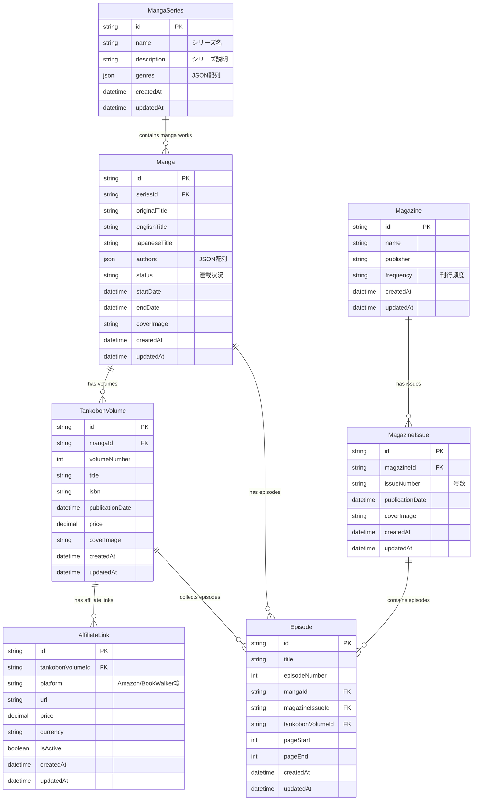
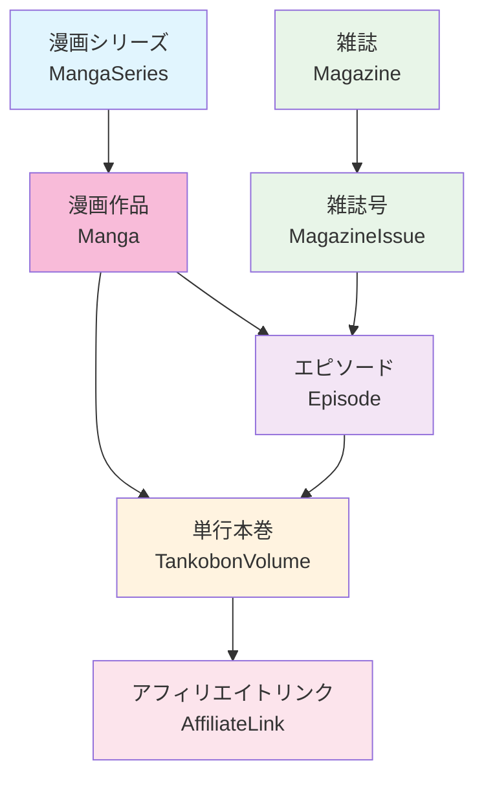

# データベーススキーマ - ER図

## Mermaid ER図



## データフロー図



## 主要なデータ関係

### 1. 漫画情報の流れ
```
漫画シリーズ → 漫画作品 → エピソード → 雑誌掲載 → 単行本収録 → アフィリエイト
```

### 2. 検索の観点
- **シリーズ検索**: MangaSeries.name
- **作者検索**: Manga.authors (JSON配列)
- **ジャンル検索**: MangaSeries.genres (JSON配列)  
- **年代検索**: Manga.startDate
- **雑誌検索**: Magazine.name → MagazineIssue → Episode

### 3. アフィリエイト収益
- TankobonVolume → AffiliateLink（複数プラットフォーム対応）

## JSON フィールド構造例

### MangaSeries.authors
```json
[
  {
    "name": "尾田栄一郎",
    "role": "作者"
  },
  {
    "name": "田中真弓", 
    "role": "作画協力"
  }
]
```

### MangaSeries.genres
```json
[
  "少年漫画",
  "冒険", 
  "バトル",
  "コメディ"
]
```

## インデックス設計

```sql
-- 検索最適化
CREATE GIN INDEX idx_manga_series_genres ON MangaSeries USING gin(genres);
CREATE INDEX idx_manga_status ON Manga(status);
CREATE INDEX idx_manga_start_date ON Manga(startDate);
CREATE GIN INDEX idx_manga_authors ON Manga USING gin(authors);

-- 関係性最適化
CREATE INDEX idx_manga_series ON Manga(seriesId);
CREATE INDEX idx_episode_manga ON Episode(mangaId, episodeNumber);
CREATE INDEX idx_episode_magazine_issue ON Episode(magazineIssueId);
CREATE INDEX idx_tankobon_manga ON TankobonVolume(mangaId, volumeNumber);
CREATE INDEX idx_affiliate_tankobon ON AffiliateLink(tankobonVolumeId);
```

## テーブル作成例 (Prisma Schema)

```prisma
model MangaSeries {
  id              String    @id @default(cuid())
  name            String
  description     String?
  genres          Json      // JSON配列
  
  manga           Manga[]
  
  createdAt       DateTime  @default(now())
  updatedAt       DateTime  @updatedAt
}

model Manga {
  id              String    @id @default(cuid())
  seriesId        String?
  originalTitle   String
  englishTitle    String?
  japaneseTitle   String?
  authors         Json      // JSON配列
  status          String    @default("ongoing")
  startDate       DateTime?
  endDate         DateTime?
  coverImage      String?
  
  series          MangaSeries? @relation(fields: [seriesId], references: [id])
  episodes        Episode[]
  volumes         TankobonVolume[]
  
  createdAt       DateTime  @default(now())
  updatedAt       DateTime  @updatedAt
  
  @@index([seriesId])
  @@index([status])
  @@index([startDate])
}

model Episode {
  id              String    @id @default(cuid())
  title           String
  episodeNumber   Int
  mangaId         String
  magazineIssueId String?
  tankobonVolumeId String?
  pageStart       Int?
  pageEnd         Int?
  
  manga           Manga          @relation(fields: [mangaId], references: [id], onDelete: Cascade)
  magazineIssue   MagazineIssue? @relation(fields: [magazineIssueId], references: [id])
  tankobonVolume  TankobonVolume? @relation(fields: [tankobonVolumeId], references: [id])
  
  createdAt       DateTime  @default(now())
  updatedAt       DateTime  @updatedAt
  
  @@unique([mangaId, episodeNumber])
  @@index([magazineIssueId])
  @@index([tankobonVolumeId])
}
```